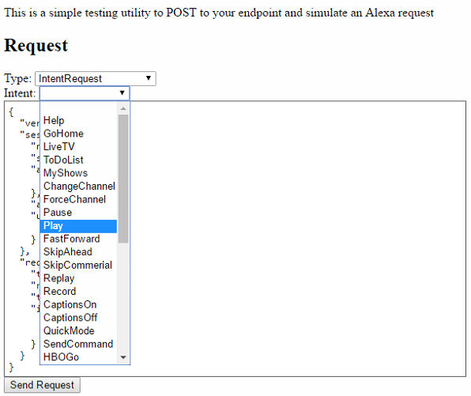
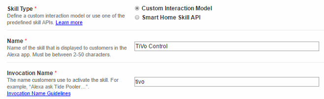
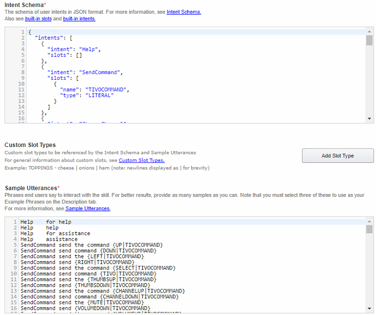
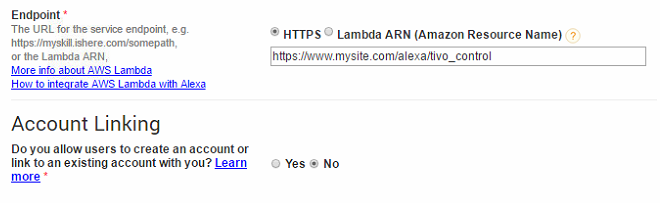
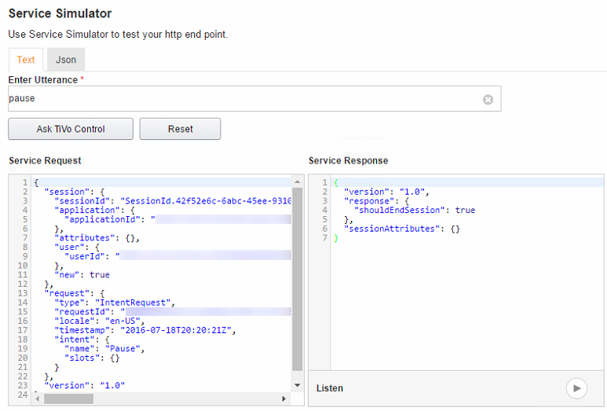

# alexa_tivo_control
Alexa skill to control a TiVo DVR with the Amazon Echo and voice commands

- - -
## Requirements

* [Node](https://nodejs.org/en/)
* [Alexa-App-Server](https://www.npmjs.com/package/alexa-app-server)
* [Alexa-App](https://www.npmjs.com/package/alexa-app)

- - -
## Installation Instructions

1. Clone this repository into your Alexa-App-Server apps directory:
   ```
   git clone https://github.com/jradwan/alexa_tivo_control.git
   ```

2. Install any missing dependencies (telnet-client, etc.):
   ```
   npm install
   ```

3. Copy config_example.json to config.json:
   ```
   cp config_example.json config.json
   ```

   Edit the config.json file and make the following changes:
   ```
   tivoIP: enter the IP address of the TiVo to control
   tivoMini: set to 'true' if controlling a TiVo Mini
   ```
   
   If you've hidden unused Video Providers on your TiVo (under Settings & Messages > Settings > Channels > My Video Providers), set the corresponding entries in the file to 'false'. For example: 
   ```
   "hbogo": false,
   "amazon": true,
   "netflix": false,
   "hulu": false,
   "youtube": true,
   "mlbtv": false,
   "plex": true,
   "vudu": true,
   "hsn": false,
   "aol": false,
   "flixfling": false,
   "toongoggles": false,
   "wwe": false,
   "yahoo": false,
   "yupptv": false,
   ```

   Audio providers are normally not customizable on the TiVo so those settings should be left as 'true'. If for some reason a provider does *not* appear on your TiVo, you can set the corresponding entry to 'false'.
   ```  
   "pandora": true,
   "spotify": false,
   "iheartradio": true
   ```

   These settings are used to dynamically generate remote key-presses for menu navigation so incorrect settings could cause unexpected navigation.

4. Start the Alexa-App-Server:
   ```
   node server.js
   ```

   You should see the TiVo Control app registered as an endpoint in the console log:
   ```
   Serving static content from: public_html
   Loading server-side modules from: server
      Loaded /opt/alexa-app-server/server/login.js
   Loading apps from: apps
      Loaded app [alexa_tivo_control] at endpoint: /tivo_control
   Listening on HTTP port 8085
   ```

5. Enable the network remote control on your TiVo (under Settings & Messages > Remote, CableCARD, & Devices > Network Remote Control. Your TiVo's IP address must be accessible (via telnet on the same local network) from your Alexa-App-Server.

6. In a browser, open the TiVo Control endpoint on your Alexa-App-Server (i.e., http://localhost:8085/tivo_control) and you should see the Alexa Tester page. Here you can set the "Type" field to "IntentRequest", choose an "Intent" (i.e., action) from the dropdown menu, and click "Send Request" to trigger the intent.

   
   
   For example: select "Pause" from the dropdown and click "Send Request." If your configuration is correct and working, your TiVo should pause. Select "Play" then "Send Request" and playback should resume. The console log will show debugging information:
   ```
   QueuedCommands: PAUSE
   Connection Created
   RECEIVED: CH_STATUS 1287 LOCAL
   Sending Prefixed Command: IRCODE PAUSE
   QueuedCommands: PLAY
   Connection Created
   RECEIVED: CH_STATUS 1287 LOCAL
   Sending Prefixed Command: IRCODE PLAY
   ```

   You can test the other intents (such as launching the video/audio providers) on this page to confirm your configuration settings.
   
7. In order to link TiVo Control to your Amazon Echo, you'll need an [Amazon Developer](https://developer.amazon.com/home.html) account and your Alexa-App-Server must be available over the public internet via SSL (HTTPS). In the Alexa Skills Kit area of the developer console, click "Add a New Skill." Name your skill (ex. TiVo Control) and set an invocation name (ex. tivo).

      
   
8. On the Interaction Model page, copy in the "Intent Schema" and "Sample Utterances" text from the Alexa Tester page (see step 6).

      

9. On the Configuration page, select HTTPS for the "Endpoint" and fill in the URL of your Alexa-App-Server and TiVo Control endpoint. Remember the URL must be accessible via HTTPS over the public internet (setting up that configuration is outside the scope of this document).

      

10. Save the skill. Copy the "Application Id" from the "Skill Information Page" into the alexaAppId attribute in the config.json file (from step 3 above) and restart your Alexa-App-Server.

11. On the Test page, enter a sample utterance (ex. pause) and click "Ask TiVo Control." If your setup is correct, the Alexa skill on the Amazon servers will send a JSON request to your endpoint and a response should be received.

      
   
12. The skill should now be active on your Echo account (as a development skill in test mode). You can confirm this by looking at the "Your Skills" page on your Alexa web page or app. Test it out by asking Alexa to control your TiVo and watch the magic happen!
   ```
   Alexa, tell TiVo to pause
   Alexa, tell TiVo to replay
   Alexa, ask TiVo to go to channel one oh oh nine
   Alexa, ask TiVo to go to My Shows
   Alexa, ask TiVo to turn on captions
   Alexa, tell TiVo to launch YouTube
   Alexa, ask TiVo to list my providers
   ```
   
- - -
## Contact

Jeremy C. Radwan

- https://github.com/jradwan
- http://www.windracer.net/blog

- - -
## References

This project was forked from and inspired by https://github.com/grgisme/alexa_tivo_control

[Hosting a Custom Skill as a Web Service](https://developer.amazon.com/public/solutions/alexa/alexa-skills-kit/docs/developing-an-alexa-skill-as-a-web-service) (Amazon)

[Step-by-Step Guide to Build a Fact Skill](https://developer.amazon.com/public/community/post/Tx3DVGG0K0TPUGQ/New-Alexa-Skills-Kit-Template:-Step-by-Step-Guide-to-Build-a-Fact-Skill) (Amazon)

[Developing Alexa Skills Locally with Node.js: Setting Up Your Local Environment](https://www.bignerdranch.com/blog/developing-alexa-skills-locally-with-nodejs-setting-up-your-local-environment/) (Big Nerd Ranch)

[Tivo Network Remote Documentation](http://www.tivo.com/assets/images/abouttivo/resources/downloads/brochures/TiVo_TCP_Network_Remote_Control_Protocol.pdf) (TiVo)
